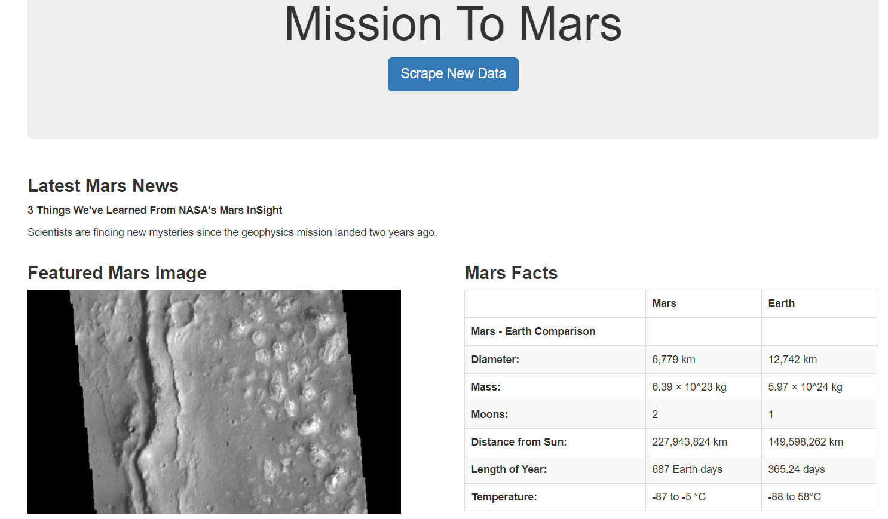
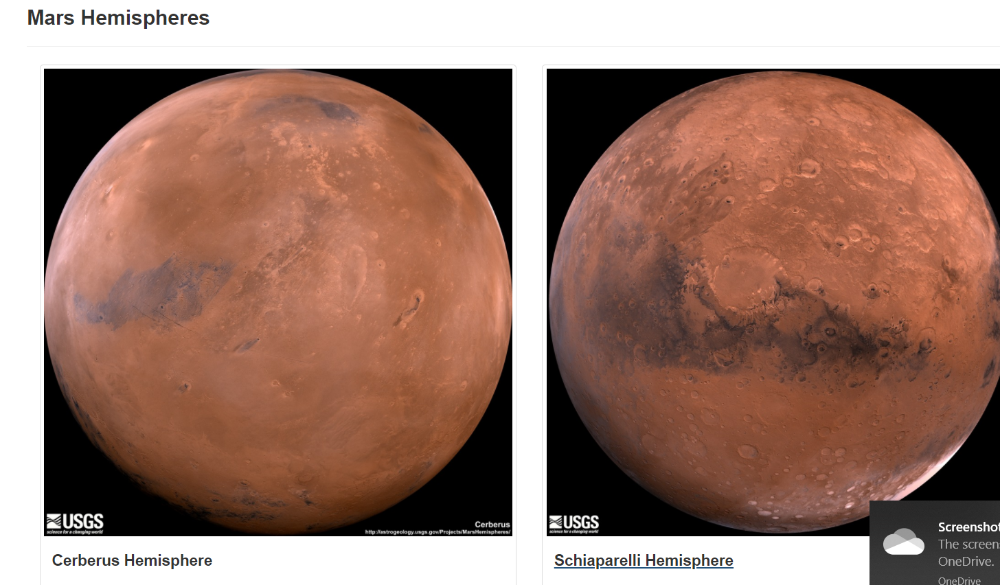
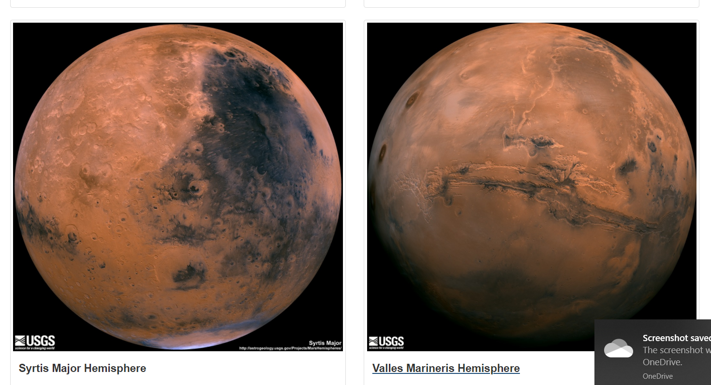

# web-scraping-challenge

## Introduction

This is my submission for the Web Scraping Challenge Homework

## Structure

```
|_templates
	|_index.html
|_.gitignore
|_README.md
|_app.py
|_mission_to_mars.ipynb
|_scrape_mars.py

```

## Usage

```
python 3.8.5
pandas 1.2.4
splinter 0.14.0
beautifulsoup4 4.9.3
webdriver_manger 3.4.2
flask 1.1.2
flask_pymongo 2.3.0
pymongo 3.11.4

#The app page was created using:
HTML5
Bootstrap 4.3.1

```

## Summary

The completed app scapes all urls to produce a final html dashboard as pictured below:

<br>



<br>



<br>




